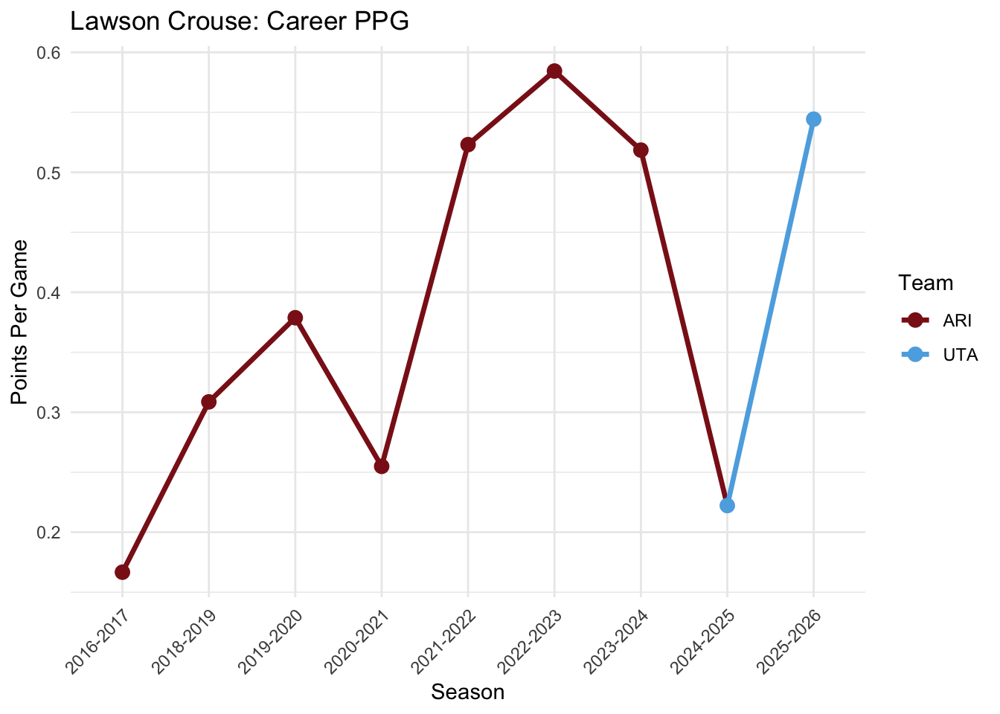

# Arizona to Utah: A Neural Network Analysis of Former Coyotes Player Performance After Relocation

**Author:** Sarah Bird

Did the Arizona Coyotes' relocation to Utah cause a real improvement in player performance, or does the "Utah effect" reflect natural player development? This project uses a single-layer neural network to model expected player performance (points per game) and compares it against actual performance before and after the 2024 relocation.

## Key Finding

The model does not support the idea that Arizona held these players back. Residuals showed no meaningful clustering above or below the predicted PPG line by franchise. Arizona and Utah players performed at rates similar to what the model predicted based on their prior PPG, age, average ice time, and years in system. Thus, there isn't enough evidence that the relocation improved performance.

That said, some individual trajectories were genuinely interesting:
- **Clayton Keller** has consistently outperformed expectations in both cities, especially in Utah.
- **Logan Cooley** exceeded predictions in one season but matched expectations in the other — hard to draw conclusions given his age and limited sample.
- **Lawson Crouse** performed as expected for most of his Arizona tenure, dropped sharply in his first Utah season, and rebounded the next — a pattern that looks like an adjustment period following relocation.


*Crouse's PPG trajectory across both franchises, with a clear dip in his first Utah season followed by recovery.*

## Model

- **Type:** Feedforward neural network, single hidden layer (K = 10 hidden units), tanh activation
- **Inputs:** age, years in system, average ice time, prior PPG
- **Output:** predicted points per game (PPG) for a given season
- **Why a neural network over linear regression:** player development is rarely linear, and a neural net can capture curved relationships that a linear model would miss

**Implementation** built from scratch in base R (manual forward/backward propagation, gradient descent) rather than using an existing neural network package, to control the training process directly

**Limitations:** the model explains ~56% of variance (R² ≈ 0.56), so a substantial share of performance is driven by factors outside the model (coaching, linemates, personal circumstances, etc.). The dataset is also imbalanced — Utah has only 2 seasons of data while Arizona has many more. This widens the residual spread for Utah players and limits how much weight any single-season Utah result should carry.

## Data

11 players who logged at least one 50+ game season with both the Arizona Coyotes and Utah Mammoth. Season-level stats include games played, goals, assists, points, PPG, plus/minus, and average ice time.

## Repo Structure

```
├── data/
│   └── PlayerStats.csv          # season-level player stats, ARI + UTA
├── report/
│   ├── final_report.Rmd         # full write-up with code
│   ├── final_report.pdf         # rendered report
│   ├── appendix.Rmd              
│   └── appendix.pdf              # supplementary tables/diagnostics
└── figures/
    └── crouse_ppg.png
```

## Tools

R (base), custom-built feedforward neural network (manual forward/backward propagation, tanh activation, L2 regularization, mini-batch gradient descent), dplyr for data prep, ggplot2 for visualization

---

*This project started as a personal question about whether location accounted for a decade of Coyotes underperformance. The model doesn't support that idea, which is a small point of closure for Arizona hockey fans.
